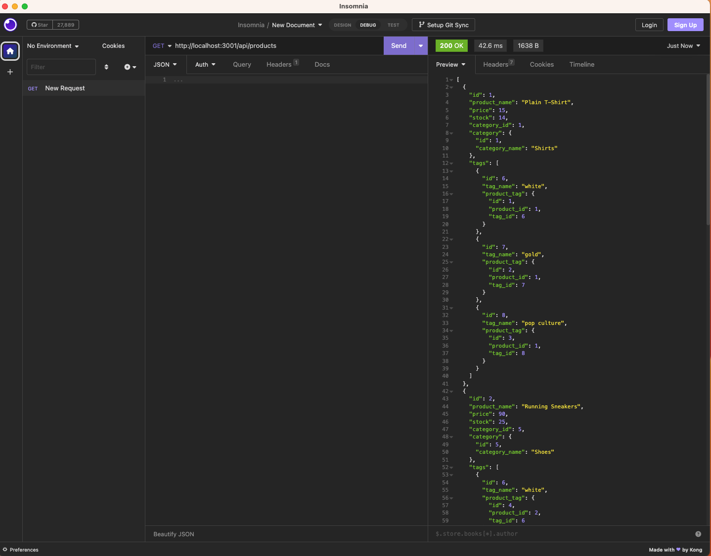

 # 13-Ecommerce-Back-End-App

  
  
    

  ## Table of Contents

  * [Description](#description)
  * [Installation](#installation)
  * [Usage](#usage)
  * [MIT](https://choosealicense.com/licenses/MIT)
  * [Contributing](#contributing)
  * [Tests](#tests)
  * [Questions](#questions)
  
  ## [Description](#table-of-contents)

  This back-end application is used for managing a database for an e-commerce website. An Express.js API uses Sequelize to interact with a MySQL database to GET, POST, PUT, and DELETE information in different tables within the database. Users can GET info from any of the tables, GET info from a table using a specific ID, POST (create) a new category/product/tag, PUT (update) an existing category/product/tag, or DELETE an exsiting category/prodcut/tag by its ID.  

  ## [Installation](#table-of-contents)

  First, ensure Node.js is installed on your machine. Then clone the project repository to your machine. Use the command 'npm i' to install dependencies. After this you must create an .env file in the root directory and enter the database name and your MySQL login information. Next, navigate into the database folder and open MySQL using the command 'mysql -u root -p'. Enter your login credentials and the create the database by running SOURCE schema.sql; in the command line. Quit MySQL and navigate back to the root directory. Lastly, seed your database using the command 'npm run seed' in the command line.

  ## [Usage](#table-of-contents)

  Start the server using 'npm start' in the command line. Next, access the API routes using Insomnia using the desired endpoints in order to make requests to the database. Refer to the video demonstration for use of API route endpoints using Insomnia. 

  [Video Demonstration](https://drive.google.com/file/d/1j1qYpRjDWbhrXFknN6fjsmzft8Iu9X__/view)

  

  ## [License](#table-of-contents)

  
    
  The application is covered under the following license:
    
    
  [MIT](https://choosealicense.com/licenses/MIT)
    
    

  ## [Contributing](#table-of-contents)

  Starter code was provided by Xander Rapstine ([Xandromus](https://github.com/Xandromus))

  ## [Tests](#table-of-contents)

  N/A

  ## [Questions](#table-of-contents)

  Please contact me using the following links:

  [GitHub](https://github.com/Tagne13)

  [Email: Tagne13@gmail.com](mailto:Tagne13@gmail.com)
